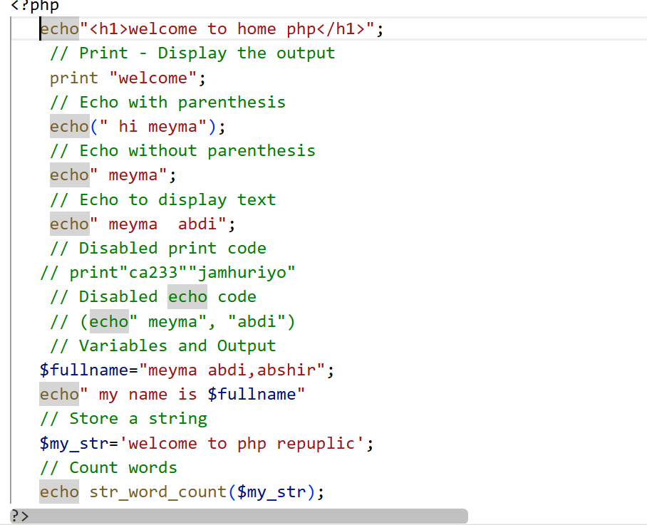

# PHP Programming Screenshots

This folder contains screenshots demonstrating PHP programming concepts covered in the course **Web Application Development - PHP & MySQL**.

# PHP Introduction Screenshots

This folder contains screenshots explaining the basic concepts of PHP in the course **Web Application Development - PHP & MySQL**.

## 1. Echo and Print Statements

### Screenshot Name
`PHP_Echo_Print_Code.png`

### Screenshot


### Description
This screenshot demonstrates how to generate output in PHP using `echo` and `print`, working with variables, and using string built-in functions.

#### Echo Example
```php
echo "<h1>welcome to home php</h1>";
echo(" hi meyma");
echo " meyma";
echo " meyma  abdi";
Print Example

print "welcome";
Variables and Output

$fullname = "meyma abdi,abshir";
echo " my name is $fullname";
String Word Count Function

$my_str = 'welcome to php repuplic';
echo str_word_count($my_str); // Outputs: 4
2. Difference Between Echo and Print
Description
This section explains the differences between echo and print as practiced in the code.

Echo
Used to output text or HTML markup to the browser.

Can accept multiple arguments (though usually used with one).

Does not return any value and is slightly faster.


echo "<h1>welcome to home php</h1>";
Print
Used to display text in the browser.

Accepts only one argument.

Returns a value of 1 (can be used in expressions).


print "welcome";
Note: Parentheses are optional for both:


echo " meyma";
echo(" hi meyma");